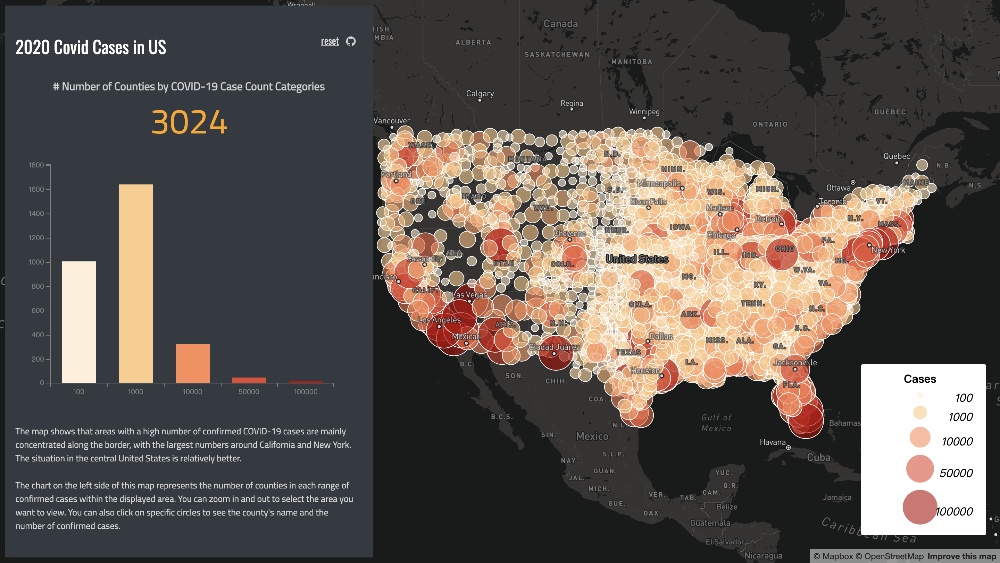
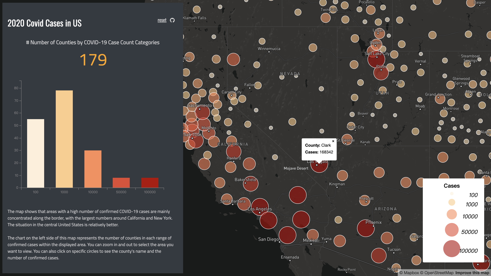

# Dashboard showing the distribution of COVID-19 cases in the United States

## AI Disclosure

> I used AI in this assignment for debbuging only. 

---

## Project Overview

This lab created a smart dashboard to display the COVID-19 infection situation in the United States in 2020. The data I chose was collected at the county level. On the map, circles of different sizes and colors represent the number of COVID-19 infections in each county. Smaller, lighter-colored circles represent fewer infections, and vice versa. There's also a statistical chart on the left side of the interface, showing how many counties are within each range of confirmed cases in the map's displayed area. Clicking on a circle reveals the name of that specific county and the exact number of confirmed cases.

---

## Map display

### Main Map View

---

### Display Visual Components

---

## Interactive Map Link

You can view the smart dashboard here:

🔗 **Link:**  
[Open the dashboard](https://lily-liu61.github.io/Dashboard/)

---

## Why I Chose This Type of Map

My choice of a scaled map to present 2020 US county-level COVID-19 infection data stems primarily from the fact that this data represents the specific number of confirmed cases per county. Scaled maps are well-suited for visually representing differences between different units, allowing for more intuitive comparisons by changing the size and color of the circles. For example, in this dataset, the number of confirmed cases in each county can be clearly judged by the size and color of the circles, providing a direct understanding of the overall data.

Furthermore, compared to a choropleth map, I believe the advantage of a scaled map lies in its independence from the size of the counties. Because US counties vary significantly in size, using a tiered color map would make larger counties, even with lower numbers of confirmed cases, stand out visually, diverting the viewer's attention from the map's central message. A scaled map, through its unified symbolic form, focuses the visual emphasis on the "quantity" itself, directly highlighting the map's theme.

Therefore, I believe that scaled maps, which visually represent spatial distribution patterns while clearly expressing quantitative differences, are perfectly suited to the theme I want to present in this lab.

---
